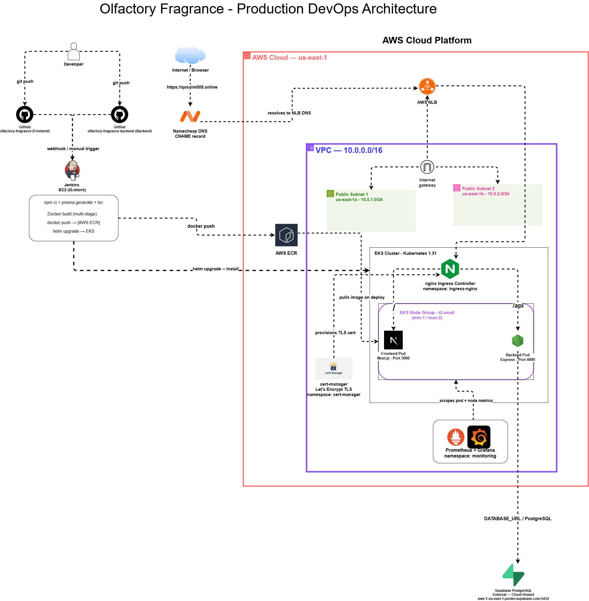

# Terraform + EKS + Helm + Jenkins (Production DevOps Project)

A fully automated, production-grade cloud infrastructure project deploying a 3-tier fragrance e-commerce application on AWS EKS using Terraform, Helm, and Jenkins CI/CD.

## Live Application
<!-- - **URL**: https://qossim005.online -->
- **Frontend**: Next.js 14 (App Router)
- **Backend**: Node.js + Express REST API
- **Database**: Supabase PostgreSQL (managed cloud)

## Architecture Overview


## Repository Structure

This is the **infrastructure repository**. Application code lives in separate repositories following a polyrepo pattern:

- **Frontend**: https://github.com/qezman/olfactory-fragrance
- **Backend**: https://github.com/qezman/olfactory-fragrance-backend

eks-project/
├── terraform/
│   ├── main.tf                  # Root module - wires all modules together
│   ├── variables.tf             # Global variables
│   ├── outputs.tf               # Exposed outputs (IPs, URLs, cluster name)
│   ├── provider.tf              # AWS provider configuration
│   └── modules/
│       ├── vpc/                 # VPC, subnets, internet gateway, route tables
│       ├── eks/                 # EKS cluster, node group, IAM roles
│       ├── ec2/                 # Jenkins server with automated setup
│       └── ecr/                 # ECR repositories for frontend and backend
├── app/                         # See README inside
├── k8s/                         # See README inside
└── jenkins/                     # See README inside

## Infrastructure Stack

| Component | Technology |
|---|---|
| Cloud Provider | AWS (us-east-1) |
| Infrastructure as Code | Terraform v1.15 |
| Container Orchestration | AWS EKS (Kubernetes 1.31) |
| Package Management | Helm v3 |
| CI/CD | Jenkins |
| Image Registry | AWS ECR |
| Networking | VPC, Public Subnets, Internet Gateway |
| Ingress | nginx-ingress + AWS Network Load Balancer |
| TLS/SSL | cert-manager + Let's Encrypt |
| Monitoring | Prometheus + Grafana (kube-prometheus-stack) |
| DNS | Namecheap → AWS NLB |

## AWS Resources Provisioned

| Resource | Details |
|---|---|
| VPC | 10.0.0.0/16 with 2 public subnets across 2 AZs |
| EKS Cluster | Kubernetes 1.31, API_AND_CONFIG_MAP auth |
| EKS Node Group | t3.small, min 1 / max 2 nodes |
| EC2 Jenkins | t3.micro, Ubuntu 24.04, auto-configured |
| ECR Repositories | eks-project-frontend, eks-project-backend |
| IAM Roles | EKS cluster role, node role, Jenkins role |

## Quick Start

### Prerequisites
- AWS CLI configured
- Terraform >= 1.3
- kubectl
- Helm v3

### Provision Infrastructure
```bash
cd terraform
terraform init
terraform apply -auto-approve
```

### Configure kubectl
```bash
aws eks update-kubeconfig --region us-east-1 --name eks-project-eks
kubectl get nodes
```

### Post-Provisioning Steps
After EC2 Jenkins is up:
1. Attach `eks-project-jenkins-role` IAM role to Jenkins EC2
2. Update EKS auth mode: `aws eks update-cluster-config --name eks-project-eks --access-config authenticationMode=API_AND_CONFIG_MAP`
3. Grant Jenkins role cluster access via `aws eks create-access-entry` and `aws eks associate-access-policy`
4. Install nginx-ingress: `helm upgrade --install ingress-nginx ingress-nginx/ingress-nginx --namespace ingress-nginx --create-namespace`
5. Install cert-manager: `helm upgrade --install cert-manager jetstack/cert-manager --namespace cert-manager --create-namespace --set crds.enabled=true`
6. Configure Jenkins pipelines for frontend and backend repos

### Destroy Infrastructure
```bash
terraform destroy -auto-approve
```
> Note: Supabase database is external and unaffected by destroy.

## CI/CD Pipeline Flow

## Kubernetes Namespaces

| Namespace | Contents |
|---|---|
| olfactory | Frontend + Backend application pods |
| ingress-nginx | nginx Ingress Controller |
| cert-manager | TLS certificate automation |
| monitoring | Prometheus + Grafana |

## Author
Kazeem Jimoh